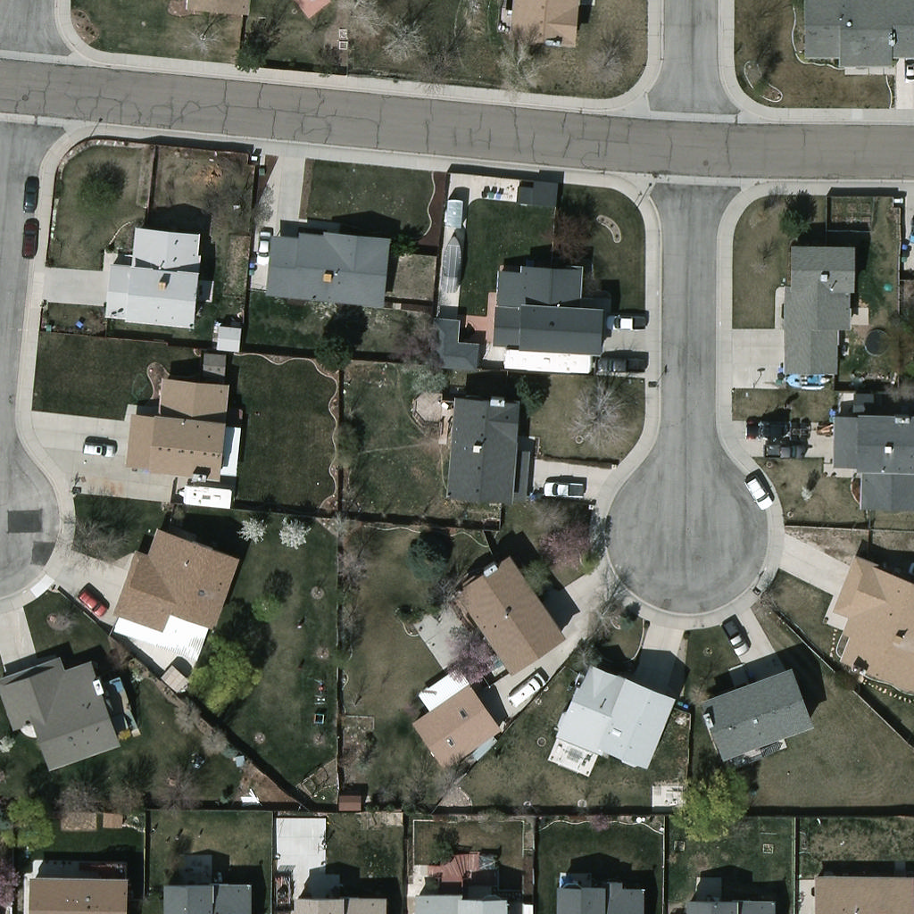
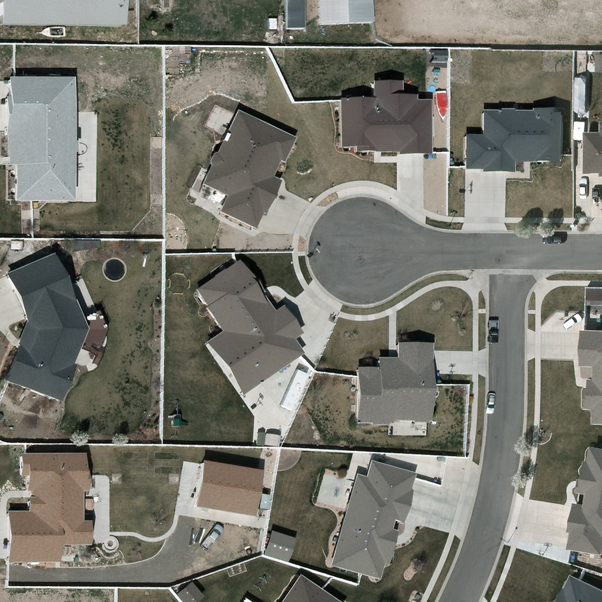
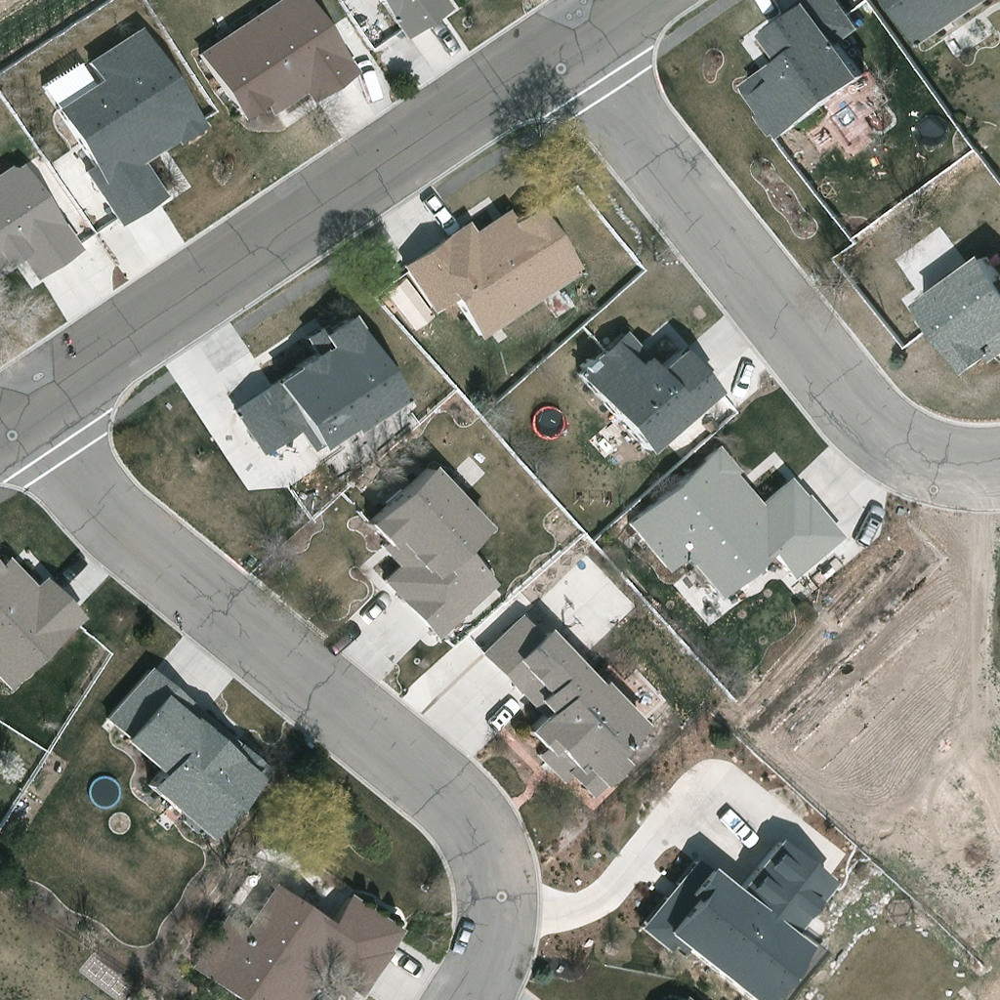
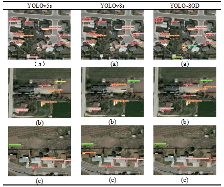
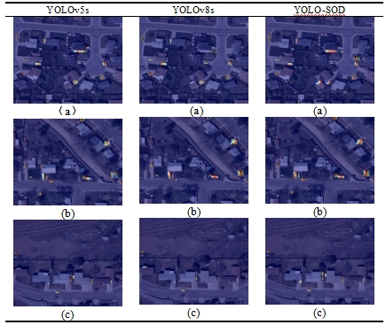
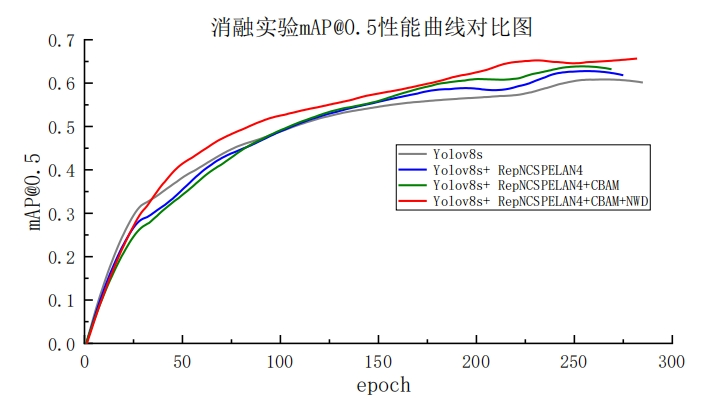

# 基于 YOLOv8 改进的航空影像小目标检测
<div align=center>  </div>

- 设计了一种基于 YOLOv8 改进的航空影像小目标检测算法 YOLO-SOD。该模型既适用于彩色图像的地面小目标检测，也适用于红外图像、低分辨率图像的多任务检测场景。
- 在对 YOLOv8 所有组成部分进行研究的过程中，我发现其损失函数存在一个明显的缺陷，即对于小目标来说，检测框的位置偏差和尺度偏差对检测性能的影响程度是不同的，检测框的轻微位置偏移就会导致目标落在检测框外，而检测框宽高变化时目标仍然能够出现在检测框内。为此，提出了两种解决方案，一种是通过对损失函数中的中心点位置偏差项和宽高尺度偏差项施加不同的权重，一种是引入 NWD 损失函数，这两种措施都能让模型更加关注目标检测框的位置偏差，进而提升微小物体的检测性能。
- 此外，YOLOv8 的网络结构仍然可以优化。具体来讲，一方面通过利用广义高效聚合模块 RepNCSPELAN4 作为 YOLOv8 主干网络中的特征提取模块, 该模块利用分割和重组概念，同时引入 ELAN 的层级处理方式，可以从轻量化、推理速度和精确度方面提高目标检测模型的整体性能。另一方面，在上述改进的基础上，在颈部网络的 C2f 模块中融合 CBAM 注意力机制，使网络在融合多尺度特征的同时更加关注检测目标区域，来提升模型对小目标的检测性能。

## 环境配置
推荐使用 `conda` 虚拟环境
```
conda create -n name python=3.9
conda activate name
pip install -r requirements.txt
pip install -e .
```

## 如何使用
### 命令行
可以在命令行界面（CLI）中直接使用，只需输入 `yolo` 命令：
```bash
yolo predict model=best.pt
```

### Python
也可以在 Python 环境中直接使用，并接受与上述 CLI 示例中相同的参数：
```python
from ultralytics import YOLO

# 加载模型
model = YOLO("yolov8s_final.yaml")  # 从头开始构建新模型
# model = YOLO("yolov8n.pt")  # 加载预训练模型

# 使用模型
model.train(data="mydata.yaml", epochs=300)  # 训练模型
metrics = model.val()  # 在验证集上评估模型性能
results = model("test.jpg")  # 对图像进行预测
```

## 可视化实验结果
<div align=center>  </div>
